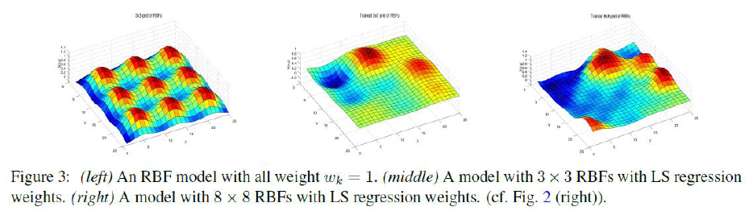

# Image-Correction
In this project, I utilized Radial Basis Function (RBF) regression for image inpainting, which involved predicting and restoring corrupted pixels in grayscale images. The task was modeled by assigning brightness as a function of pixel position. I determined the optimal basis functions for regression to restore local smoothness in the image. The model was then fine-tuned by varying parameters such as RBF spacing, width, and the regularization constant, leading to enhanced image restoration and prediction accuracy. This project showcased my ability to apply machine learning techniques in image processing and optimization.

# Examples of restored images:

# Background Information:

# RBF Image:

